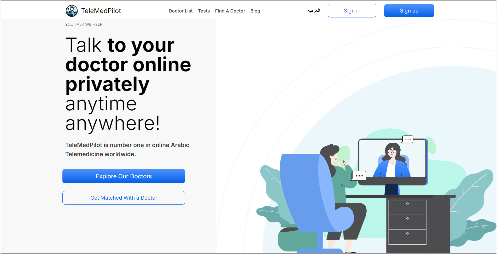

  

# Telemedicine App

## **Your Virtual Healthcare Companion**

A telemedicine platform designed to connect patients with certified doctors via secure online consultations. It simplifies healthcare by offering features such as video calls, appointment booking, secure messaging, and medical record management, making healthcare more accessible and convenient.

---

> Home page showcasing the doctor search and booking functionality.

## Features

- Video Calls (Agora): Seamless video consultations between doctors and patients.
- Doctor and Patient Signup: Doctors can manage their availability, and patients can easily book appointments.
- Appointment Scheduling: Doctors can add, edit, or delete time slots, while patients can browse available slots and book appointments.
- Medical Records: Patients have access to their prescriptions, test results, and visit history.
- Secure Messaging: Patients can communicate with doctors for follow-ups or additional questions.

## **Why Choose Telemedicine?**

- **Flexible Appointments:** Book online or in-person consultations at your convenience.
- **Doctor Search & Filters:** Find the right doctor based on specialty, experience, and availability.
- **Personalized Care:** Get customized treatment plans and prescriptions.
- **Secure Communication:** Send messages securely to your doctor for follow-ups or additional questions.
- **Medical Record Management:** Easily access and manage your prescriptions, test results, and visit history.

---

## **How Telemedicine Works**

1. **Create an Account:** Sign up and set up your profile.
2. **Book an Appointment:** Search for doctors and choose a time that works for you.
3. **Consult Online:** Meet with your doctor via video or phone.
4. **Receive Treatment:** Get a diagnosis and personalized treatment plan.
5. **Access Medical Records:** Safely manage your prescriptions and visit history online.

---

---
## **Technologies Used (Frontend)**

- **Next.js (TypeScript):** For building user interfaces.
- **Tailwind CSS:** For styling and responsive design.
- **Custom Hooks:** For efficient state management.
- **Git:** Version control.
- **Responsive Design:** Optimized for mobile and desktop experiences.

---

## **Learnings from This Project**

In this project, I learned how to effectively manage:

1. **Team Communication:**
   Working in an Agile team with daily standups and sprints helped keep the project on track and enabled quick problem resolution.

2. **API Integration:**
   I handled intensive API integrations, debugging common issues like CORS and authentication, and ensuring real-time data sync between frontend and backend.

---

## **Acknowledgements**

Special thanks to the Telemedicine team for their dedication to building this platform. The project wouldn't have been possible without contributions from:

- **Frontend Team:** UI/UX development and responsive design.
- **Backend Team:** API integrations and data security.
- **Cloud Engineers:** Ensuring smooth deployment and scalability.
- **Mobile App Team**

## **Contact Information**

- **Author:** [Madhavi Thakare](https://github.com/MadhaviTaa/)
- **Email:** [madhavithakare270@gmail.com](mailto:madhavithakare@gmail.com)
- **LinkedIn:** [Madhavi Thakare](www.linkedin.com/in/madhavi-thakare27)

---

